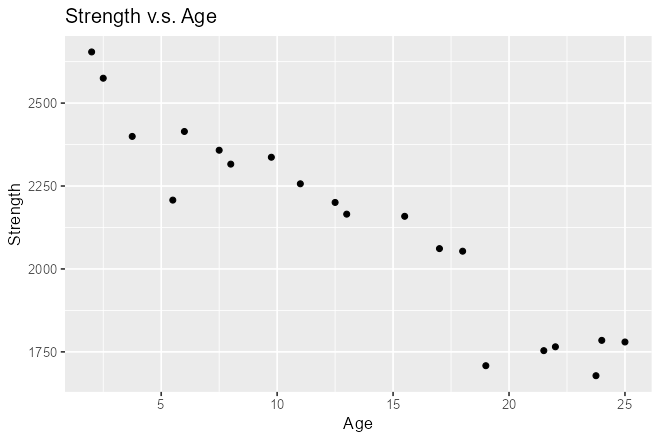
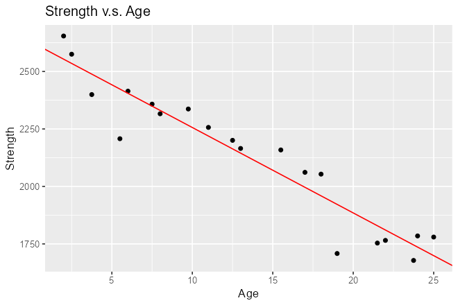
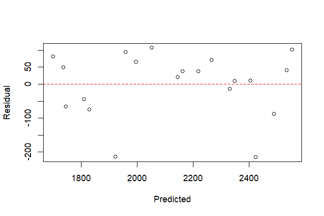
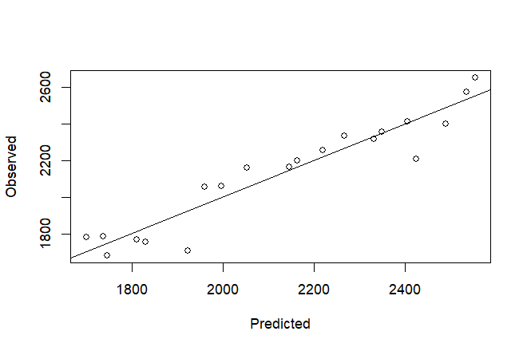

---
# 实验（课程章下的 leaf bundle）：scripts/new-content.sh lab 生成，
# 也可以由 chapter 子命令的 --materials 一次建好。
# 与 notes.md / homework.md 一样，不要在这里写 tags / categories —— 课程标签由
# 课程主页 _index.md 的 cascade 下发，而 cascade 只填空：本页一旦自己写了 tags，
# 就会整体丢掉继承来的课程标签。
# 键必须与 notes.md 完全一致：scripts/check-editor-schema.mjs 用一份字段表覆盖三种材料页。
title: "实验"
weight: 5
icon: "🧪"
date: 2026-09-15
draft: false
description: "R 上机：导入数据、ggplot 散点、lm 拟合、残差与观测诊断图，并用 lm 的结果手算复核全部公式。"
---


## 一、R 函数讲解

本节按「做一次回归实验的动作顺序」讲本次首次出现的函数：把数据读进来 → 看清它 → 画图 → 拟合与取结果 → 手算检验时的分布函数 → 公式语法细则。每处给最小示例，示例都可直接运行。

### 1 把数据读进来

#### 1.1 工作目录

```r
getwd()          # 查看当前工作目录
setwd("C:/REG")  # 设定工作目录
```

路径用正斜杠 `/`，或写成双反斜杠 `\\`；单独一个 `\` 会被当成转义符，这是 Windows 下读文件失败最常见的原因。`setwd` 只对当前会话有效；Rmd 渲染时的工作目录是文件所在目录，与交互式会话常不一致——读文件时给**完整路径**最省事。

#### 1.2 读表格的三种函数

```r
read.table("data.txt", header = TRUE, sep = "")   # 通用文本表格
read.csv("data.csv")                              # 逗号分隔，header 默认 TRUE
readxl::read_xls("TB2_1_RocketProp_6e.xls")       # .xls（Excel 97-2003）
readxl::read_excel("data.xlsx")                   # .xlsx，也能读 .xls
```

- `readxl` 包不需要装 Java 或 Excel，比旧的 `xlsx`/`RODBC` 路线轻。加载一次后可直接写 `read_xls()`。
- `read_xls()` 返回的是 tibble，用 `as.data.frame()` 转成普通数据框，后续按 `[行, 列]` 取值、列名去重的行为更接近课堂习惯。
- **列名会被自动改造**：含空格、括号、百分号的列名转换成点号，例如 `Shear Strength (psi)` 变成 `Shear.Strength..psi.`。任务一第 (3) 步改名不是多余动作，是必须做的。

### 2 看清数据长什么样

#### 2.1 四个查看函数

```r
head(TB2_1, 3)    # 前 3 行
str(TB2_1)        # 结构：类型与每一列的模式
names(TB2_1)      # 列名
nrow(TB2_1); ncol(TB2_1); dim(TB2_1)   # 行数、列数、维度
```

`head()` 看数值是否读进来，`str()` 看类型是否读对。两者互补：数字被读成字符型时 `head()` 看着正常，`str()` 一栏 `chr` 就会暴露。

#### 2.2 取列：`$` 与 `[[ ]]`

```r
TB2_1$strength        # 按列名取一列，返回向量
TB2_1[["strength"]]   # 等价写法，列名在变量里时用这个：TB2_1[[nm]]
TB2_1[, 1]            # 按位置取第 1 列
TB2_1[1:3, ]          # 前 3 行、所有列
```

`$` 后面不能跟变量（`TB2_1$col` 里的 `col` 只能是字面列名），要按变量名取列必须用 `[[ ]]`。

#### 2.3 改名

```r
names(TB2_1) <- c("strength", "age")     # 整体改
colnames(TB2_1)[1:2] <- c("strength", "age")
TB2_1 <- setNames(TB2_1, c("strength", "age"))[c("strength", "age")]  # 顺带选列
```

改名后旧列名立即失效，后续代码若仍引用旧名会报 `object not found`——所以改名要放在绘图与拟合**之前**做一次。

### 3 画图

#### 3.1 ggplot2 的图层语法

```r
library(ggplot2)
p <- ggplot(TB2_1, aes(x = age, y = strength)) + geom_point()
```

三段式：`ggplot(数据, aes(变量映射))` 定坐标系，`+ geom_*()` 加图层，`+ 主题/标签` 调整外观。图层可逐个叠加，也可以在已有对象上继续加：

```r
p + geom_abline(intercept = 2627.82, slope = -37.154, color = "red")
```

把图存成对象 `p` 的好处正在这里：同一张底图可以复制出多个版本（加拟合线、加水平线、换坐标），不必重写前两段。

#### 3.2 本次用到的几何对象

| 函数 | 画什么 | 关键参数 |
|---|---|---|
| `geom_point()` | 散点 | 点形状 `shape`、大小 `size` |
| `geom_abline()` | 直线（给定截距与斜率） | `intercept`、`slope`、`color` |
| `geom_hline()` | 水平线 | `yintercept`（残差图的 0 线用 `yintercept = 0`） |
| `geom_smooth(method = "lm")` | 直接加最小二乘线 | 与手算 `geom_abline` 结果应一致 |

用 `geom_abline` 显式给出 `coef(lmfit)`，等于把「拟合结果」与「图上的线」绑在同一个数上；这样若发现线没穿过数据中心，问题一定在数据或公式，而不在画图。

#### 3.3 标题与轴标签

```r
p + ggtitle("Strength v.s. Age") + xlab("Age") + ylab("Strength")
p + labs(title = "Strength v.s. Age", x = "Age", y = "Strength")   # 一次写完
```

#### 3.4 保存图片

```r
ggsave("figs/01_scatter.png", plot = p, width = 6, height = 4, dpi = 110)  # ggplot 对象
png("figs/03_resid.png", width = 660, height = 440, res = 110)             # 基础图形
plot(x, y); dev.off()                                                      # 必须关设备
```

`ggsave()` 默认存「当前最后一张图」，显式写 `plot = p` 更稳。基础图形必须用 `dev.off()` 关闭设备，漏掉会得到空文件或不完整的图。

#### 3.5 基础图形：`plot()` + `abline()`

```r
plot(TB2_2$yhat, TB2_2$e, xlab = "Predicted", ylab = "Residual")
abline(h = 0, col = "red", lty = 2)          # 水平参考线
plot(TB2_2$yhat, TB2_2$y, xlab = "Predicted", ylab = "Observed")
abline(0, 1)                                 # 截距 0、斜率 1 的对角线
```

两张诊断图值得记住它们各自回答什么问题：**残差对拟合值**回答「模型形式与方差假设是否成立」，**观测对拟合值**回答「预测准不准」。后者的对角线是「完美预测」的位置，点越贴近对角线，拟合越好。

### 4 拟合与取结果

#### 4.1 `lm()` 与公式

```r
lmfit <- lm(strength ~ age, data = TB2_1)
```

`lm` 的第一个参数是**公式**，写「响应 ~ 解释变量」；`data =` 指定到哪个数据框里找这些变量名。`lmfit` 是一个列表对象，里面装了系数、拟合值、残差、QR 分解等，后续用 `coef()`、`fitted()`、`residuals()` 分别取。

#### 4.2 `summary()` 的每一行长什么样

```r
summary(lmfit)
```

输出分五块，读法如下（数值取自本次实验）：

```
Coefficients:
            Estimate Std. Error t value Pr(>|t|)
(Intercept) 2627.822     44.184   59.48  < 2e-16 ***
age          -37.154      2.889  -12.86 1.64e-10 ***

Residual standard error: 96.11 on 18 degrees of freedom
Multiple R-squared:  0.9018,	Adjusted R-squared:  0.8964
F-statistic: 165.4 on 1 and 18 DF,  p-value: 1.643e-10
```

| 输出项 | 含义 |
|— |— |
| `Estimate` | 参数估计 $\hat\beta_0=2627.822$、$\hat\beta_1=-37.154$ |
| `Std. Error` | 标准误 $\operatorname{se}(\hat\beta_j)$，分母用 $\hat\sigma$ 与 $S_{xx}$ |
| `t value` | $t_0=\hat\beta_j/\operatorname{se}(\hat\beta_j)$，检验 $H_0:\beta_j=0$ |
| `Pr(&gt;&#124;t&#124;)` | 双边 $p$ 值。$1.64\times10^{-10}$ 远小于 $0.05$，拒绝 $\beta_1=0$ |
| `Residual standard error` | $\hat\sigma=\sqrt{SS_{\rm res}/(n-2)}=96.11$，误差标准差估计，单位与被解释变量相同 |
| `Multiple R-squared` | $R^2=0.9018$，回归解释掉的变异比例 |
| `Adjusted R-squared` | 自由度校正后的 $0.8964$；加变量惩罚更重 |
| `F-statistic` | $F_0=165.4$，检验「所有斜率同时为零」；单变量时 $F_0=t_0^2=(-12.86)^2$ |

`signif. codes` 那一行是显著性标记：`***` 对应 $p<0.001$，`**` 对应 $0.001\le p<0.01$，依此类推。

#### 4.3 取具体结果

```r
coef(lmfit)         # 系数向量，coef(lmfit)[1] 是截距，[2] 是斜率
fitted(lmfit)       # 拟合值 ŷ_i
residuals(lmfit)    # 残差 e_i = y_i - ŷ_i
predict(lmfit, newdata = data.frame(age = 10))   # 新点预测
```

`fitted()` 与 `residuals()` 是任务三建 `y/yhat/e` 三列表的现成来源，不必自己再算一遍。**手算与函数结果对照**是有价值的习惯：本次脚本里两者在 $10^{-10}$ 量级内一致，说明每一步的公式用对了。

#### 4.4 `anova()`：方差分析表

```r
anova(lmfit)
```

```
Response: strength
          Df  Sum Sq Mean Sq F value    Pr(>F)
age        1 1527483 1527483  165.38 1.643e-10 ***
Residuals 18  166255    9236
```

列的含义：`Df` 自由度（回归 $1$、残差 $n-2=18$），`Sum Sq` 平方和（$SS_{\rm reg}$、$SS_{\rm res}$），`Mean Sq` 平方和除自由度（$MS_{\rm reg}$、$\hat\sigma^2$），`F value` 为 $MS_{\rm reg}/MS_{\rm res}$。单变量情形下这个 $F$ 检验与斜率的 $t$ 检验等价：$F_0=t_0^2$。

#### 4.5 `confint()`：参数置信区间

```r
confint(lmfit)                     # 默认 95%
confint(lmfit, level = 0.99)       # 99%
```

给出的是**模型参数的区间**，不是残差的区间。输出 `age` 一行 `[-43.223, -31.084]` 即斜率 $\beta_1$ 的 95% 置信区间，它不含 0，与 $p<0.05$ 的结论一致。

### 5 分布函数：手算 $t$ 检验时用

R 的分布函数只有四种前缀，记住命名规则就够用：

| 前缀 | 含义 | 例 |
|---|---|---|
| `d` | 密度函数 | `dt(x, df)` |
| `p` | 累积分布函数 $P(X\le x)$ | `pt(t0, df)` |
| `q` | 分位点（`p` 的逆） | `qt(0.975, 18)` |
| `r` | 随机数 | `rt(10, df)` |

检验里常用的几个：

```r
qt(0.975, df = 18)                       # t 的 0.975 分位点 = 2.100922
2 * pt(-abs(t0), df = 18)                # 双边 p 值
qf(0.95, df1 = 1, df2 = 18)              # F 的 0.95 分位点
1 - pf(F0, df1 = 1, df2 = 18)            # F 检验的 p 值
```

`pt()` 的 `lower.tail = FALSE` 可以直接给上尾概率，省掉 `1 -` 的舍入误差。手算 $p$ 值与 `summary` 输出对照，能确认自己用的自由度没写错——自由度写错是最不容易被察觉的错误。

### 6 公式语法细则

```r
lm(y ~ x, data = d)          # 标准形式
lm(y ~ x - 1, data = d)      # 过原点（等价于 y ~ 0 + x）
lm(y ~ x1 + x2, data = d)    # 多变量（下一章）
lm(y ~ I(x^2), data = d)     # I() 保护算术运算，直接写 y ~ x^2 会被当成交互项
lm(y ~ sqrt(x), data = d)    # 函数变换
```

- `~` 左边是响应，右边是解释变量；`+` 是「加入」，不是算术加号。
- `- 1` 表示去掉截距项，**过原点模型必须显式去掉截距**，否则 R 默认带截距（这是下一节会看到的差别）。
- `data =` 参数里的变量名在数据框中查找；不写 `data =` 时在全局环境里找。
- 变量若是**因子**（分类变量），R 会自动生成哑变量；若是字符型，会报错或按因子处理，取决于 `stringsAsFactors`。数值本来该参与计算的列读成字符型，是拟合失败的一个隐蔽来源。

## 二、函数速查表

| 函数 | 作用 | 关键参数 | 最小示例 |
|---|---|---|---|
| `setwd()` / `getwd()` | 设定 / 查看工作目录 | 路径用 `/` | `setwd("C:/REG")` |
| `read.csv()` | 读逗号分隔文本 | `header`、`stringsAsFactors` | `read.csv("d.csv")` |
| `read.table()` | 读通用文本表格 | `sep`、`header` | `read.table("d.txt", header = TRUE)` |
| `readxl::read_xls()` | 读 .xls | 路径 | `read_xls("TB2_1.xls")` |
| `readxl::read_excel()` | 读 .xls / .xlsx | `sheet` | `read_excel("d.xlsx")` |
| `head()` | 看前若干行 | `n` | `head(TB2_1, 3)` |
| `str()` | 看类型与结构 | — | `str(TB2_1)` |
| `names()` / `colnames()` | 列名 | 赋值即改名 | `names(d) <- c("strength","age")` |
| `nrow()` / `ncol()` / `dim()` | 行数 / 列数 / 维度 | — | `n <- nrow(TB2_1)` |
| `$` / `[[ ]]` | 取一列 | `[[` 支持变量列名 | `d[["age"]]` |
| `ggplot()` + `aes()` | 建坐标系、定映射 | `x`、`y` | `ggplot(d, aes(x = age, y = strength))` |
| `geom_point()` | 散点 | `color`、`size` | `+ geom_point()` |
| `geom_abline()` | 给定截距斜率的直线 | `intercept`、`slope`、`color` | `+ geom_abline(intercept = a, slope = b)` |
| `geom_hline()` | 水平线 | `yintercept` | `+ geom_hline(yintercept = 0, lty = 2)` |
| `ggtitle()` / `xlab()` / `ylab()` / `labs()` | 标题与轴标签 | — | `+ labs(title = "S v.s. A", x = "Age")` |
| `ggsave()` | 保存 ggplot 对象 | `plot`、`width`、`height`、`dpi` | `ggsave("f.png", plot = p)` |
| `png()` / `dev.off()` | 基础图形保存设备的开关 | `width`、`height`、`res` | `png("f.png"); plot(x,y); dev.off()` |
| `plot()` | 基础散点图 | `xlab`、`ylab` | `plot(d$yhat, d$e)` |
| `abline()` | 加参考线 / 拟合线 | `h`、`v`、`intercept`、`slope` | `abline(h = 0, col = "red")` |
| `lm()` | 最小二乘拟合 | 公式、`data` | `lm(y ~ x, data = d)` |
| `summary()` | 拟合结果全表 | 对象 | `summary(lmfit)` |
| `coef()` | 取系数 | 对象 | `coef(lmfit)[2]` |
| `fitted()` / `residuals()` | 取拟合值 / 残差 | 对象 | `residuals(lmfit)` |
| `predict()` | 新点预测 | `newdata`、`interval` | `predict(lmfit, data.frame(age = 10))` |
| `anova()` | 方差分析表 | 对象 | `anova(lmfit)` |
| `confint()` | 参数置信区间 | `level` | `confint(lmfit, level = 0.99)` |
| `qt()` / `pt()` | t 分位点 / t 概率 | `df`、`lower.tail` | `qt(0.975, 18)` |
| `qf()` / `pf()` | F 分位点 / F 概率 | `df1`、`df2` | `qf(0.95, 1, 18)` |

## 三、题目与解答

### 任务一 导入数据与散点图

**题目**

> 以火箭推进剂例子为例验证 OLS 估计的计算，并在练习中复习课堂理论内容。
> （1）导入文件 `REG/data/DataSets6e/TB2_1_RocketProp_6e.xls`，数据名设为 `TB2_1`；（2）查看数据前 3 行看数据是否导入成功；（3）将数据中的变量名修改为 `strength` 和 `age`；（4）设样本量为 `n`；（5）利用 `ggplot` 绘制散点图，横坐标为 Age，纵坐标为 Strength，标题为 Strength v.s. Age，保存为 `p`。

**解答**

```r
library(ggplot2)
library(readxl)

TB2_1 <- as.data.frame(read_xls("REG/data/DataSets6e/TB2_1_RocketProp_6e.xls"))
head(TB2_1, 3)

names(TB2_1) <- c("strength", "age")
n <- nrow(TB2_1)

p <- ggplot(TB2_1, aes(x = age, y = strength)) +
  geom_point() +
  ggtitle("Strength v.s. Age") +
  xlab("Age") + ylab("Strength")

p
```

**输出**

```
  Shear.Strength..psi. Age.of.Propellant..weeks.
1              2158.70                     15.50
2              1678.15                     23.75
3              2316.00                      8.00

[1] 20
```



### 任务二 最小二乘拟合与散点图加线

**题目**

> （1）用 `lm` 函数拟合简单线性回归，其中 `strength` 为响应变量，`age` 为解释变量，拟合结果记为 `lmfit`；（2）用 `summary` 函数查看详细输出结果，指出各个输出值的含义；（3）记 `a` 为截距估计，`b` 为斜率估计，在散点图 `p` 上用 `geom_abline` 函数添加拟合线，拟合线的颜色设为红色。

**解答**

```r
lmfit <- lm(strength ~ age, data = TB2_1)
summary(lmfit)

a <- coef(lmfit)[1]
b <- coef(lmfit)[2]

p + geom_abline(intercept = a, slope = b, color = "red")
```

**输出**

```
Call:
lm(formula = strength ~ age, data = TB2_1)

Residuals:
    Min      1Q  Median      3Q     Max
-215.98  -50.68   28.74   66.61  106.76

Coefficients:
            Estimate Std. Error t value Pr(>|t|)
(Intercept) 2627.822     44.184   59.48  < 2e-16 ***
age          -37.154      2.889  -12.86 1.64e-10 ***
---
Signif. codes:  0 '***' 0.001 '**' 0.01 '*' 0.05 '.' 0.1 ' ' 1

Residual standard error: 96.11 on 18 degrees of freedom
Multiple R-squared:  0.9018,	Adjusted R-squared:  0.8964
F-statistic: 165.4 on 1 and 18 DF,  p-value: 1.643e-10
```

**各输出值的含义**

| 输出项 | 含义 | 本例数值 |
|---|---|---|
| `Call` | 拟合所用的公式与数据 | `strength ~ age`, 数据 `TB2_1` |
| `Residuals` | 残差 $e_i=y_i-\hat y_i$ 的五数概括（最小、下四分位、中位、上四分位、最大） | 最小 $-215.98$、最大 $106.76$；中位数 $28.74$ 偏离 0 说明分布略偏斜 |
| `Coefficients` 的 `Estimate` | 参数估计 $\hat\beta_0$、$\hat\beta_1$ | $2627.822$、$-37.154$ |
| `Std. Error` | 系数标准误 $\operatorname{se}(\hat\beta_j)$ | $44.184$、$2.889$ |
| `t value` | $t_0=\hat\beta_j/\operatorname{se}(\hat\beta_j)$，检验 $\beta_j=0$ | $59.48$、$-12.86$ |
| `Pr(&gt;&#124;t&#124;)` | 双边 $p$ 值 | 截距 $<2\times10^{-16}$，斜率 $1.64\times10^{-10}$ |
| `Signif. codes` | 显著性标记 | `***` 表示 $p<0.001$ |
| `Residual standard error` | $\hat\sigma=\sqrt{SS_{\rm res}/(n-2)}$，残差标准差，自由度 $n-2=18$ | $96.11$，18 个自由度 |
| `Multiple R-squared` | $R^2=SS_{\rm reg}/SS_{\rm T}$ | $0.9018$ |
| `Adjusted R-squared` | 自由度校正后的决定系数 | $0.8964$ |
| `F-statistic` | $F_0=MS_{\rm reg}/MS_{\rm res}$，检验「全部斜率同时为零」 | $165.4$，自由度为 $1$ 与 $18$，$p=1.643\times10^{-10}$ |

斜率含义：推进剂年龄每增加 1 周，剪切强度平均下降 $37.154$ psi；截距 $2627.822$ 是「刚出厂」时的平均强度（数据的最小 $x=2$ 距原点不远，该解释在此处还算合理）。



### 任务三 拟合值、残差表与两张诊断图

**题目**

> （1）构造表 2.2，记为 `TB2_2`，该表有三列，分别为观测值 `y`，拟合值 `yhat`，残差值 `e`；查看 `TB2_2` 的前 6 行并对比；（2）以 `yhat` 为横坐标、`e` 为纵坐标，绘制残差散点图，并在纵坐标 0 处添加红色水平虚线（该图可用于评估模型假设是否满足）；（3）以 `yhat` 为横坐标、`y` 为纵坐标绘图，并绘制对角线，横坐标标记为 `Predicted`，纵坐标标记为 `Observed`，该图可用于观察拟合值是否接近于观测值。

**解答**

```r
TB2_2 <- data.frame(y = TB2_1$strength,
                    yhat = fitted(lmfit),
                    e = residuals(lmfit))
head(TB2_2, 6)

plot(TB2_2$yhat, TB2_2$e, xlab = "Predicted", ylab = "Residual")
abline(h = 0, col = "red", lty = 2)

plot(TB2_2$yhat, TB2_2$y, xlab = "Predicted", ylab = "Observed")
abline(0, 1)
```

**输出**

```
        y     yhat          e
1 2158.70 2051.942  106.75830
2 1678.15 1745.425  -67.27457
3 2316.00 2330.594  -14.59363
4 2061.30 1996.211   65.08869
5 2207.50 2423.478 -215.97761
6 1708.30 1921.904 -213.60413
```

`TB2_2` 的前两列之和恰为第一列（$y=\hat y+e$），可用 `all.equal(TB2_2$y, TB2_2$yhat + TB2_2$e)` 验证；残差的和为 0，即 $\sum e_i=0$。





### 任务四 用公式手算一遍

**题目**

> 用公式计算验证所讲的一些结论（为了简便，把预测变量记为 `x`，响应变量记为 `y`）：
> （1）依次计算 `Sxy`，`Sxx`；（2）计算斜率估计记为 `beta1_hat`，计算斜率估计 `beta0_hat`；（3）计算拟合值 `yhat`，残差值 `e`；（4）计算总平方和 `SST`，回归平方和 `SSreg`，残差平方和 `SSres`，验证是否满足 `SST = SSreg + SSres`；（5）计算残差标准差 `sigma_hat`；（6）计算参数估计的标准误差 `se_beta0` 和 `se_beta1`；（7）计算 `t` 比及对应 `p` 值；（8）计算 `R` 方。

**解答**

```r
x <- TB2_1$age; y <- TB2_1$strength
xbar <- mean(x); ybar <- mean(y)

Sxy <- sum((x - xbar) * (y - ybar))
Sxx <- sum((x - xbar)^2)

beta1_hat <- Sxy / Sxx
beta0_hat <- ybar - beta1_hat * xbar

yhat <- beta0_hat + beta1_hat * x
e <- y - yhat

SST   <- sum((y - ybar)^2)
SSreg <- sum((yhat - ybar)^2)
SSres <- sum(e^2)
SST - (SSreg + SSres)

sigma_hat <- sqrt(SSres / (n - 2))

se_beta0 <- sigma_hat * sqrt(1 / n + xbar^2 / Sxx)
se_beta1 <- sigma_hat / sqrt(Sxx)

t0 <- beta1_hat / se_beta1
pval <- 2 * pt(-abs(t0), df = n - 2)

R2 <- SSreg / SST
```

**输出**

```
[1] Sxy = -41112.65      Sxx = 1106.559
[1] beta1_hat = -37.15359    beta0_hat = 2627.822
[1] 前 3 个 yhat: 2051.942 1745.425 2330.594
    前 3 个 e:    106.7583 -67.27457 -14.59363
[1] SST = 1693738   SSreg = 1527483   SSres = 166254.9
[1] SST - (SSreg + SSres) = 0        # 分解精确成立
[1] sigma_hat = 96.10609
[1] se_beta0 = 44.18391    se_beta1 = 2.889107
[1] t = -12.85989          p = 1.643344e-10
[1] R^2 = 0.9018414
```

手算结果与 `lm` 内置输出对照：

```
                manual        lmfit
b0        2627.8223590 2627.8223590
b1         -37.1535909  -37.1535909
sigma_hat   96.1060924   96.1060924
R2           0.9018414    0.9018414
全部一致： TRUE
```

`SST = SSreg + SSres` 在浮点意义下误差为 0（`sum((y-ybar)^2)` 与两项之和在机器精度内相等），这一点只在模型中**含截距**时成立。

### 任务五 方差分析表与置信区间

**题目**

> （1）`anova(lmfit)` 计算方差分析表；（2）计算参数置信区间；（3）用 `confint` 函数计算残差置信区间。

**解答**

```r
anova(lmfit)
confint(lmfit)
```

**输出**

```
Analysis of Variance Table

Response: strength
          Df  Sum Sq Mean Sq F value    Pr(>F)
age        1 1527483 1527483  165.38 1.643e-10 ***
Residuals 18  166255    9236
---
Signif. codes:  0 '***' 0.001 '**' 0.01 '*' 0.05 '.' 0.1 ' ' 1

                 2.5 %    97.5 %
(Intercept) 2534.99540 2720.6493
age          -43.22338  -31.0838
```

方差分析表与任务四的手算一致：$SS_{\rm reg}=1527483$、$SS_{\rm res}=166255$、$MS_{\rm res}=9236=\hat\sigma^2$、$F_0=1527483/9236=165.38$；单变量情形 $F_0=t_0^2=(-12.85989)^2=165.38$。

`confint(lmfit)` 给出的是**模型参数** $\beta_0,\beta_1$ 的 95% 置信区间，分别 `[2535.00, 2720.65]` 与 `[-43.22, -31.08]`。残差不是模型参数，没有「残差的置信区间」；若要看残差的取值范围，用 `summary(residuals(lmfit))` 或 `quantile(residuals(lmfit))`。斜率区间不包含 0，与 $p=1.64\times10^{-10}$ 拒绝 $\beta_1=0$ 的结论一致（命题 7.8：水平 $\alpha$ 下的双边检验 $H_0:\beta_1=\beta_{10}$ 不拒绝 $\iff$ $\beta_1$ 的 $1-\alpha$ 置信区间包含 $\beta_{10}$）。

`level = 0.99` 可换置信水平：

```r
confint(lmfit, level = 0.99)
```

### 任务六 氧气纯度数据（习题 2.7）

**题目**

> 通过分馏工艺产生的氧气纯度被认为与处理装置主冷凝器中烃的百分比有关。数据文件 `data-prob-2-7.xls` 有二十个样品的数据。
> （1）读取数据；（2）绘制散点图；（3）以 `purity` 为响应变量，拟合简单线性回归模型，绘制拟合图；（4）检验假设 $H_0:\beta_1=0$；（5）`hydro` 可以解释 `purity` 多大比例的变异？（6）计算斜率的置信区间；（7）当 `hydro` 为 1 时，计算 `purity` 的均值估计及其置信区间。

**解答**

```r
oxy <- as.data.frame(read_xls("REG/data/DataSets6e/data-prob-2-7.xls"))
head(oxy, 3)
names(oxy) <- c("purity", "hydro")

oxyfit <- lm(purity ~ hydro, data = oxy)
summary(oxyfit)

ggplot(oxy, aes(x = hydro, y = purity)) +
  geom_point() +
  geom_smooth(method = "lm", se = FALSE, color = "red") +
  ggtitle("Purity v.s. Hydrocarbon") +
  xlab("Hydrocarbon (%)") + ylab("Purity (%)")

# (4) H0: beta1 = 0 的检验
summary(oxyfit)$coefficients["hydro", c("t value", "Pr(>|t|)")]

# (5) 解释的变异比例
summary(oxyfit)$r.squared

# (6) 斜率的 95% 置信区间
confint(oxyfit, "hydro")

# (7) hydro = 1 处 purity 均值的估计与置信区间
predict(oxyfit, newdata = data.frame(hydro = 1), interval = "confidence", level = 0.95)
```

**输出**

```
（待数据文件 data-prob-2-7.xls 到位后补）
```

`predict()` 的 `interval` 参数分两种：`"confidence"` 给的是**均值响应** $E(y\mid x_0)$ 的区间，`"prediction"` 给的是**单个新观测**的区间，后者更宽（多出 $\sigma^2$ 一项）。
