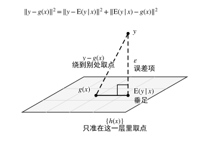
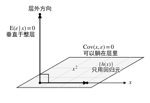
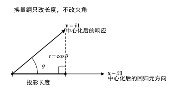

---
# 学习笔记（课程章下的 leaf bundle）：scripts/new-content.sh notes，
# 或 chapter 子命令的 --materials notes 生成。
# 不要在这里写 tags / categories —— 课程标签由课程主页 _index.md 的 cascade 下发，
# 而 cascade 只填空：本页一旦自己写了 tags，就会整体丢掉继承来的课程标签。
title: "学习笔记（01 章）"
weight: 1
icon: "📖"
date: 2026-09-15
draft: false
description: "§1–§8：从关联问题到定量模型、回归函数与误差项、相关与回归的分工、分析目的决定报告内容、数据的来源与固定设计、因果解释的边界、建模的迭代循环、充分性内插与外推；附例 01.1–01.3、常见误区与对照表。"
# summary 必须写：列表卡片摘要走 `.Summary | plainify`，正文公式已渲染成 HTML+MathML，会被拼成乱码
summary: "§1–§8：从关联问题到定量模型、回归函数与误差项、相关与回归的分工、分析目的决定报告内容、数据的来源与固定设计、因果解释的边界、建模的迭代循环、充分性内插与外推；附例 01.1–01.3、常见误区与对照表。"
---

## 章节目标

- 说清回归模型要解决的问题：把响应拆成「由回归元决定的部分」与「剩下的部分」。
- 分清几组常被混用的对照：相关与回归、描述与预测、内插与外推、模型充分与检验显著。
- 知道系数能解释到哪一步：数据是怎么来的，决定了结论能说到哪里。

## 先修概念

- 概率论：条件期望 $\mathrm{E}(y\mid x)$、条件方差、协方差与相关系数。
- 统计推断：总体与样本、估计量与不确定性的基本口径。
- 本章是本课程第一章，不依赖前面章节。

## 目录

- [1 从关联问题到定量模型](#1-从关联问题到定量模型)
- [2 回归函数与误差项](#2-回归函数与误差项)
- [3 相关与回归的分工](#3-相关与回归的分工)
- [4 分析目的决定报告内容](#4-分析目的决定报告内容)
- [5 数据的来源与固定设计](#5-数据的来源与固定设计)
- [6 因果解释的边界](#6-因果解释的边界)
- [7 建模的迭代循环](#7-建模的迭代循环)
- [8 充分性、内插与外推](#8-充分性内插与外推)
- [典型例题](#典型例题)
- [常见误区](#常见误区)
- [小结](#小结)

## 1 从关联问题到定量模型

实际问题很少只问两个变量有没有关系，更多时候会进一步问：变量之间相差多少、能否据此进行预测，以及在考虑改变某个变量时，响应变量是否可能随之发生变化。前两类问题主要属于回归建模的范围，而后一类问题涉及因果关系，需要额外的研究设计或假设。

把响应变量的取值拆成「由回归元决定的部分」与「剩下的部分」，是构造模型的第一步。前者取条件均值，是因为它在均方误差意义下不可超越；后者留在误差项里，承担一切没被回归元解释的东西。

**定义 01.1（回归函数与回归模型）** 设 $y$ 为响应变量（response）、$x$ 为回归元（regressor）、$\varepsilon$ 为误差项（error term）。给定 $x$ 后 $y$ 的条件均值

$$\mathrm{E}(y\mid x)=f(x)$$
称为 $y$ 对 $x$ 的回归函数（regression function）。若 $f(x)=\beta_0+\beta_1x$，把 $y$ 写成

$$y=\beta_0+\beta_1x+\varepsilon,\qquad \mathrm{E}(\varepsilon\mid x)=0$$

则称它为一元线性回归模型（simple linear regression model），其中 $\beta_0$ 为截距、$\beta_1$ 为斜率。

回归函数只描述条件均值的形状：给定 $x$ 之后，$y$ 的平均水平由它给出，这不等于 $x$ 真正「决定」了 $y$。

- 假设：$\mathrm{E}(y^2)<\infty$，故条件均值存在；$x$ 的取值有变异，否则斜率无从估计。

- 术语：回归元亦称自变量、预测变量；回归模型里的「线性」指对参数线性，不含 $e^{\beta_1x}$ 这类形式。

- 适用范围：回归元可以不止一个，也可以取 $x^2$、$x_1x_2$、$\ln x$ 这类变换后的量，模型仍属线性；$y$ 与 $x$ 之间是否存在可用直线描述的关系，属于待检验的模型设定问题，不由定义保证。

## 2 回归函数与误差项

条件均值之所以被选作回归函数，是因为它在一个明确的准则下最优：衡量预测误差需要一个尺度，平方误差是常用的一种，而在均方误差意义下，条件均值没有对手。

把这件事写成取点问题：想用某个函数 $g(x)$ 预测 $y$，给定 $X=x$ 时要定的是一个数 $g(x)$，让预测误差 $y-g(x)$ 尽量小。以平方误差 $(y-g(x))^2$ 衡量，就是最小化条件均方误差

$$\mathrm{E}\bigl[(y-g(x))^2\mid X=x\bigr].$$

那么，这个最优的数是什么？

**命题 01.2（条件均值是最优均方预测）** 设 $\mathrm{E}(y^2)<\infty$。对任意函数 $g$，只要 $g(x)$ 有定义且平方可积，就有
$$\mathrm{E}\bigl[(y-g(x))^2\bigr]\ \ge\ \mathrm{E}\bigl[(y-\mathrm{E}(y\mid x))^2\bigr]$$
等号成立当且仅当 $g(x)=\mathrm{E}(y\mid x)$ 几乎处处。

**一句话**：只用 $x$ 的信息、并以均方误差论优劣时，条件均值已经是最优预测，换成任何别的函数都只会更差。

- 条件：$\mathrm{E}(y^2)<\infty$（本章统一的矩条件口径，便于后续推断；条件均值本身的存在性只需 $\mathrm{E}\lvert y\rvert<\infty$）；$g$ 是 $x$ 的可测函数。

- 结论：均方误差在 $g(x)=\mathrm{E}(y\mid x)$ 处取到最小值，且最小值点唯一。

- 几何意义：把平方可积的随机变量看成 $L^2$ 空间里的点、内积取 $\langle u,v\rangle=\mathrm{E}(uv)$，「只用 $x$ 的信息」就是只准在子空间 $\{h(x):\mathrm{E}(h(x)^2)<\infty\}$ 里取点；$\mathrm{E}(y\mid x)$ 是 $y$ 向这个子空间的，子空间里离 $y$ 最近的点就是它。

- 强度：已证

- 证明：分四步。
  1. 加减条件均值：$y-g(x)=\bigl[y-\mathrm{E}(y\mid x)\bigr]+\bigl[\mathrm{E}(y\mid x)-g(x)\bigr]$。
  2. 平方展开，交叉项为 $2\,\mathrm{E}\bigl\{\bigl[y-\mathrm{E}(y\mid x)\bigr]\bigl[\mathrm{E}(y\mid x)-g(x)\bigr]\bigr\}$。
  3. 记 $h(x)=\mathrm{E}(y\mid x)-g(x)$，用重期望律：$\mathrm{E}\bigl\{\bigl[y-\mathrm{E}(y\mid x)\bigr]h(x)\bigr\}=\mathrm{E}\bigl\{h(x)\,\mathrm{E}\bigl[y-\mathrm{E}(y\mid x)\mid x\bigr]\bigr\}=0$，内层条件期望按定义为零。
  4. 于是 $\mathrm{E}\bigl[(y-g(x))^2\bigr]=\mathrm{E}\bigl[(y-\mathrm{E}(y\mid x))^2\bigr]+\mathrm{E}\bigl[h(x)^2\bigr]$，右端第二项非负；它为零当且仅当 $h(x)=0$ 几乎处处。

- 边界与反例：结论是「在均方误差这个准则下」的最优。换成绝对误差损失，最优预测是条件中位数，一般不等于条件均值；分布明显偏斜时两者差别不小。均方误差准则在数学上方便，但也让远离主体的观测按偏离的平方被放大，这个代价在诊断环节要还回来。

- 常见误用：把「均方误差下最优」说成「任何准则下最优」。换损失函数就换最优预测，绝对误差损失下最优点跑到条件中位数上去。

*图 01.1　平方可积的随机变量看成 $L^2$ 空间里的点、$\Vert u\Vert^2=\mathrm{E}(u^2)$：只用 $x$ 的信息就是把取点限制在下面这一层里，$\mathrm{E}(y\mid x)$ 是 $y$ 落到该层的垂足；改在 $g(x)$ 处取点，斜边的平方按勾股定理拆成两条直角边的平方和，多出的那一项非负。*

**定义 01.3（误差项与基本假设）** 记 $\varepsilon=y-\mathrm{E}(y\mid x)$，称为误差项（error term），它承担一切没被回归元解释的东西：没纳入模型的变量、响应与回归元的测量误差、以及真实存在的随机波动。

按这个分解式定义的误差有一条恒等性质

$$\mathrm{E}(\varepsilon\mid x)=\mathrm{E}\bigl[y-\mathrm{E}(y\mid x)\mid x\bigr]=0$$

它由构造给出，不是数据要满足的条件——只要误差按条件均值定义，零条件均值就自动成立。

需要当作假设提出的是回归函数的形式。在定义 01.1 的线性形式下把 $y$ 写成 $y=\beta_0+\beta_1x+\varepsilon$，这里的 $\varepsilon$ 已是「线性形式之外的剩余」，$\mathrm{E}(\varepsilon\mid x)=0$ 于是成为一句实质假设：它等价于要求这条线性形式确实给出了正确的条件均值，即 $\mathrm{E}(y\mid x)=\beta_0+\beta_1x$。也就是说，这里的零条件均值不再是由「按条件均值定义误差」自动得到的恒等式，而是**线性模型中关于条件均值形式的一项实质性假设**。

除形式假设外，常规还要求
$$\mathrm{Var}(\varepsilon\mid x)=\sigma^2,\qquad \mathrm{Cov}(\varepsilon_i,\varepsilon_j)=0\ (i\ne j)$$
两者分别称为同方差（homoscedasticity）与误差不相关（uncorrelated errors）。
- 假设：形式假设与上面两条矩条件都不要求 $\varepsilon$ 服从正态分布；正态性只在构造小样本精确区间与检验时追加。

- 术语：$\varepsilon$ 与残差（residual）$e=y-\hat y$ 是两回事——前者不可观测，后者由数据算出，是前者的估计。

- 适用范围：形式假设的作用是保证回归函数本身没有被写错；它不成立时，漏掉变量的影响通常会被算进系数，估计因而有偏——「通常」是必要的限定，个别参数在特殊结构下仍可能保持无偏。

误差项的条件里，形式假设与其余两条的逻辑地位不同。它关系到模型的形式，后两条主要关系到推断与效率——标准误、$t$ 与 $F$ 检验、预测区间：形式假设成立时，同方差与不相关都不破坏系数估计的无偏性，它们的失效让区间与检验失去名义覆盖概率。因此有下面的单向结论。

**命题 01.4（条件均值为零蕴含不相关，反之不成立）** 若 $\mathrm{E}(\varepsilon\mid x)=0$ 且二阶矩存在，则 $\mathrm{Cov}(x,\varepsilon)=0$、$\mathrm{E}(\varepsilon)=0$；反之不成立。

**一句话**：误差与回归元不相关只是条件均值为零的必要条件，看出「不相关」就宣布模型设定正确，这一步走得太快。

- 条件：$\mathrm{E}(\varepsilon\mid x)=0$（这里的 $\varepsilon$ 取线性形式之外的剩余，即定义 01.3 意义上的模型误差），且 $\mathrm{E}(x^2)$ 、$\mathrm{E}(\varepsilon^2)$ 有限。

- 结论：$\varepsilon$ 与 $x$ 不相关、$\mathrm{E}(\varepsilon)=0$；反过来，不相关不能推出条件均值为零。

- 几何意义：$\operatorname{Cov}(x,\varepsilon)=0$ 只表示 $\varepsilon$ 与 $x$ 本身不相关。若把平方可积随机变量看成 $L^2$ 空间中的向量，这相当于说它们在 $x$ 这一方向上正交（严格说，是中心化后的向量正交）。而 $\mathrm{E}(\varepsilon\mid x)=0$ 要求更强：对任意平方可积函数 $h(x)$，都有 $\mathrm{E}[\varepsilon h(x)]=0$。也就是说，$\varepsilon$ 不仅与 $x$ 本身正交，还与所有只由 $x$ 构造出来的函数都正交，例如 $x^2$ 、$x^3$ 等。因此，$\mathrm{E}(\varepsilon\mid x)=0 \Longrightarrow \operatorname{Cov}(x,\varepsilon)=0$，但反过来一般不成立。例如，$\varepsilon$ 可能与 $x$ 不相关，却与 $x^2$ 这样的非线性函数存在系统关系，从而使得 $\mathrm{E}(\varepsilon\mid x)\neq 0$。

- 强度：已证

- 证明：分两步。
  1. 取期望：$\mathrm{E}(\varepsilon)=\mathrm{E}\bigl[\mathrm{E}(\varepsilon\mid x)\bigr]=0$。取乘积期望：$\mathrm{E}(x\varepsilon)=\mathrm{E}\bigl[x\,\mathrm{E}(\varepsilon\mid x)\bigr]=0$，故 $\mathrm{Cov}(x,\varepsilon)=\mathrm{E}(x\varepsilon)-\mathrm{E}(x)\mathrm{E}(\varepsilon)=0$。
  2. 反向的反例见下。

- 边界与反例：取 $x$ 在 $\{-1,0,1\}$ 上等可能取值，令 $\varepsilon=x^2-\frac23+u$，其中 $u$ 与 $x$ 独立，且 $\mathrm{E}(u)=0$、$\mathrm{Var}(u)=\sigma_u^2$。则 $\mathrm{E}(\varepsilon\mid x)=x^2-\frac23$，在 $x=\pm1$ 处等于 $\frac13$、在 $x=0$ 处等于 $-\frac23$，条件均值明显非零；另一方面 $\mathrm{E}(x\varepsilon)=\mathrm{E}\left[x\left(x^2-\frac23\right)\right]+\mathrm{E}(xu)=0+0=0$，又 $\mathrm{E}(x)=0$、$\mathrm{E}(\varepsilon)=0$，故 $\mathrm{Cov}(x,\varepsilon)=0$。这正是回归曲线呈 U 形时的典型样貌：线性模型把曲率塞进误差项，误差项里带着关于 $x$ 的系统结构，而它与回归元仍不相关——只看这一项看不出设定错误。修正方向是把 $x^2$ 作为回归元加进模型，而不是继续用误差项吸收它。

- 常见误用：用「残差与 $x$ 的样本协方差为零」来宣布模型设定正确。含截距的普通最小二乘拟合本身就保证残差与 $x$ 正交，这个量即使为零，也排除不了残差里明显的曲率或其他系统结构。

*图 01.2　平面是「回归元的一切函数」张成的那一层：$\mathrm{Cov}(x,\varepsilon)=0$ 只禁止沿 $x$ 那一支的分量，误差仍可沿 $x^2$ 这类弯曲方向待在层内；$\mathrm{E}(\varepsilon\mid x)=0$ 要求垂直于层内每个方向，是强一档的条件，差的那一档正是这些方向。*

## 3 相关与回归的分工

相关与回归描述的是同一批数据，处理方式却不对称：相关系数把两个变量平等对待，回归则指定一个响应、其余作回归元。把两者当成可以互相换算的量，是初学阶段最容易沿用的一步。

相关系数的绝对值有界、与单位无关；回归斜率没有界，且带响应除以回归元的量纲。斜率估计 $\hat\beta_1=S_{xy}/S_{xx}$ 的分母随回归元的离散程度变化，所以同一批数据里换一个回归元集合，斜率的数值不具可比性，而相关系数的可比性来自它的标准化。

**命题 01.5（相关系数与回归斜率的差别）** 记样本相关系数为 $r$，一元线性回归的斜率为 $\hat\beta_1$，则 $\mathrm{sign}(r)=\mathrm{sign}(\hat\beta_1)$，且

- $|r|\le 1$，$r$ 无量纲、对两个变量的地位对称；$\hat\beta_1$ 无界、随响应与回归元的量纲改变、只在指定了哪个变量作响应之后才有定义。
- $r=0$ 只说明不存在线性关联，不说明两个变量独立。

- 假设：两个变量各自的样本标准差非零；$r$ 与 $\hat\beta_1$ 由同一样本算出。

- 结论：两者符号一致，大小与解释不同。含截距且斜率由最小二乘估计时 $r^2$ 与决定系数相等，无截距时这个等式不再成立。

- 几何意义：两列数据各自中心化后看成两个向量，$r$ 就是它们的夹角余弦，$|r|\le1$ 即 Cauchy–Schwarz；$\hat\beta_1$ 是 $y$ 的中心化向量在 $x$ 的中心化方向上的投影长度除以回归元中心化向量的长度 $\Vert\mathbf x-\bar x\mathbf 1\Vert$——同一个投影长度，回归元越分散斜率越小，所以它带量纲、可任意大。相关看夹角，回归看投影长度。

- 强度：已证

- 证明：分四步。
  1. $r=S_{xy}/\sqrt{S_{xx}S_{yy}}$、$\hat\beta_1=S_{xy}/S_{xx}$，两者同除一个正数，故同号。
  2. $|S_{xy}|\le\sqrt{S_{xx}S_{yy}}$ 给出 $|r|\le 1$（Cauchy–Schwarz）。
  3. 含截距时回归平方和 $SS_R=\hat\beta_1^2S_{xx}=S_{xy}^2/S_{xx}$，故决定系数 $R^2=SS_R/S_{yy}=S_{xy}^2/(S_{xx}S_{yy})=r^2$（完整推导见命题 02.16）。
  4. 取 $x$ 在 $\{-1,0,1\}$ 上等可能取值、$y=x^2$，则 $S_{xy}=0$ 而 $y$ 完全由 $x$ 决定，故 $r=0$ 不蕴含独立。

- 边界与反例：上一条反例说明，相关系数主要度量两个变量之间的**线性关联**，而不能反映所有形式的依赖关系。例如，当响应变量与回归元之间存在明显的抛物线关系时，如果这种关系具有适当的对称性，线性相关系数 $r$ 可以接近 0，甚至恰好等于 0，但这并不意味着两个变量之间没有关系。此时直接进行一元线性回归，只能得到一条接近水平的直线，无法反映真实的弯曲结构。因此，在决定是否采用线性模型之前，应先通过散点图观察数据的整体形状，再判断线性形式是否合理。

- 常见误用：拿 $r$ 的大小比较不同回归元的斜率。$r$ 无量纲、$\hat\beta_1$ 带量纲，两者只在「含截距的一元回归里 $r^2$ 等于决定系数」这一条上可以互推。

*图 01.3　两列数据各自中心化后看成两个向量：$r$ 读夹角，换量纲只改长度、不改夹角，所以它无量纲；回归这一侧读的是响应向量落在回归元方向上的投影长度，同一批数据换一个量纲就换一个数，可以任意大——相关有界、斜率无界，差别就在这里。*

## 4 分析目的决定报告内容

同一批数据，为预测与为判断效应而建模，需要报告的东西不同。目的不先说清，后面选变量、选模型、选诊断强度的标准就无从统一。

**定义 01.6（回归分析的四类用途）** 按分析目的，回归的用法分为

- 描述（description）：用一个式子概括响应与一组回归元的关联结构，通常报告系数、拟合优度与残差诊断。
- 预测（prediction）：对新观测给出响应的点预测与预测区间，评价标准是预测误差，而不是解释变异的比例。
- 效应估计（effect estimation）：估计某个回归元在其余变量保持不变时的单位影响，报告系数、标准误与区间。
- 筛选（screening）：从一批候选回归元中找出与响应关系最强的一部分，作为后续研究或实验的对象。

- 假设：无；分类依据是分析目的，与变量个数、数据类型无关。

- 术语：前两项偏重关系的强弱与稳定，后两项偏重单个系数的含义与不确定性。

- 适用范围：目的决定了评价指标。为预测而建的模型允许包含共线的回归元、允许出现个别系数不显著，只要预测误差小；为效应估计而建的模型要留意共线：在模型可识别（设计阵列满秩）的前提下，共线不妨碍系数被定义、估计与解释，但会放大标准误，把单个系数的区间撑宽到给不出有意义的结论；完全共线越过这条界线，此时参数不可识别，属多元回归要处理的情形。

## 5 数据的来源与固定设计

回归元是随机的还是研究者事先设定的，决定了全部推断语句的条件形式。这一点在公式上看不出来——同样的估计式，两种机制下的解释不同。

**定义 01.7（固定设计与随机设计）** 若回归元的取值在观测之前由研究者预先设定，并在统计推断中视为给定，则称为固定设计（fixed design），相应的模型称为固定回归元模型；若观测对 $(x_i,y_i)$ 来自总体 $(X,Y)$ 的随机抽样，使得回归元 $X$ 本身也是随机变量，则称为随机设计（random design）。

在固定设计下，给定的是一组预先确定的回归元取值；若同一水平上安排多个重复观测，还可以利用这些重复观测直接研究该水平下的随机误差。在随机设计下，由于 $X$ 本身具有随机性，回归模型通常表述为条件于 $X$ 的关系，例如 $\mathrm{E}(\varepsilon\mid X)=0$，表示在给定回归元取值后，误差的条件均值为零。

- 假设：固定设计下误差的期望与方差按回归元水平给定；随机设计下要求样本独立同分布。

- 术语：固定设计对应可重复的实验研究（experimental study），随机设计对应抽样调查一类的观测研究（observational study）。

- 适用范围：固定设计下样本重复若干次、条件均值可以在每个水平上单独估计，模型的形状因此可检验；随机设计下回归元的取值一般各不相同，能看到的只是条件均值的一个截面。

**注 01.8（固定设计下的重复与纯误差）** 同一回归元水平上若有多于一个观测，这些观测之间的差异只能由误差解释，据此可以给出误差方差的直接估计。没有重复时，误差方差只能由残差平方和与自由度之比间接估计，代价是把模型形式上的偏差一并当作误差。

两种机制的影响不止在估计式上。随机设计下的推断可以条件于已观测的回归元进行——把 $x_1,\dots,x_n$ 当作给定的常数，得到的就是条件语句；也可以在此之上再对回归元取一次期望，得到无条件语句，后者额外要求模型对每个可能的回归元取值都成立。两条路是两种推断口径，后者不是随机设计下的必经步骤。固定设计下没有第一层平均可取，语句只在一组事先定好的水平上成立，外推到未设定的水平没有依据。

## 6 因果解释的边界

「回归系数是效应」这句话需要额外的设计支撑。系数在数学上只描述条件均值的变化，要从描述升级到因果，必须排除其他解释——这一步靠的是数据产生方式，不是统计方法。

**注 01.9（因果解释的条件）** 要把 $\hat\beta_j$ 解释成 $x_j$ 对 $y$ 的因果效应，需要在这批数据内部成立：（i）$y$ 对 $x_j$ 的依赖关系没有遗漏的混杂变量；（ii）回归元本身不受响应影响（无反向因果）；（iii）样本的入选不依赖于响应或与响应相关的变量（无选择效应）。这三条解决的是「这份数据里的系数是不是效应」；系数能不能搬到目标总体是另一个问题，属于外部效度，与识别本身无关。

- 条件：三条任缺一条，$\hat\beta_j$ 的取值都会把非因果成分算进去；三条都只保证样本内部的解读。回归元上的测量误差会独立地破坏无偏性，是同一类问题的另一个来源（注 01.13），不在这三条之内。
- 结论：观测研究里这三条一般都不成立；随机化处理分配与潜在混杂独立，同时满足（i）与（ii），（iii）要靠抽样方案或对目标总体的论证，随机化给不出这一条。
- 强度：未证·陈述
- 边界与反例：两条独立单调上升的时间序列做回归，会得到高度显著的正斜率，而两者之间没有任何机制上的联系；这是「显著的回归关系」与「因果关系」之间距离的最短反例，具体数值见例 01.3。变量间存在共同趋势、共同的时间驱动因素时，混杂变量就是时间本身。另一头，随机化实验若只覆盖某类特殊人群（入选方式本身不按响应自选），处理效应仍可在这批人内部识别，只是结论不能直接搬到目标总体——识别与可推广性各自独立。

- 常见误用：把显著系数直接读成因果效应；反过来，把样本不代表总体当成识别失败，或者认为做了随机化就顺带保证了结论可以推广到总体。混杂、反向因果与选择效应都能各自造出显著系数；补上因果这一步靠的是随机化一类的设计，不是更复杂的模型。

## 7 建模的迭代循环

一次拟合不能给出「最终模型」。设定、拟合、诊断、修改这一循环要跑若干轮，每一轮解决上一轮暴露出来的一个问题。

**定义 01.10（回归建模的迭代循环）** 回归建模按下列步骤反复进行，直到模型在检查中不再暴露新的缺陷：

1. 明确响应变量、待检验的假设与目的（描述、预测、效应估计、筛选）。
2. 选择候选回归元，并给出回归函数的形式。
3. 拟合模型，得到系数估计与区间。
4. 检查模型是否充分：残差结构、异常观测、方差是否恒定。
5. 若不充分，修改模型（增删变量、变换、加权、改变准则）后回到第 3 步。
6. 在数据范围内解释结果，报告不确定性与诊断结论。

- 假设：每一步都要有数据支撑；回到上一步不是失败，而是流程的正常部分。
- 术语：第 4 步与第 5 步合称模型诊断（model diagnostics），是区分「拟合过」和「可以交付」的分界。
- 适用范围：回到第 2 步的代价最大，通常发生在残差暴露系统性的形状偏差时；只调整系数解释、不改模型的修订不构成新一轮。

## 8 充分性、内插与外推

模型通过整体显著性检验，只说明回归元里至少有一个与响应相关；它不说明回归函数的形式写对了，也不说明能否在数据覆盖范围之外使用。这两件事需要单独判断。

**定义 01.11（模型充分性）** 若模型的假设在数据中没有被明显违反——误差零均值、同方差、不相关、回归函数形式正确、没有个别观测主导拟合——则称模型对这批数据是充分的（adequate）。

- 假设：判断依据是诊断量（残差图、异常观测度量、偏离检验），不是整体显著性检验的结果。

- 术语：充分性针对模型的假设，显著性针对系数的取值；两者互不蕴含。

- 适用范围：充分性永远是相对于给定数据集与给定回归元范围而言的。数据换了、回归元范围扩了，原先充分的模型要重新检查。

**定义 01.12（内插与外推）** 在已有观测覆盖的回归元取值区域内取回归元的取值，据模型作出判断称为内插（interpolation）；在该区域之外取值的判断称为外推（extrapolation）。

- 假设：回归函数的线性形式只在数据范围内被检验过。

- 术语：外推的风险随离开数据范围的距离增长，且无法由模型内部的数据检验出来。

- 适用范围：一元情形下界就是回归元的取值范围本身；回归元不止一个时，逐个变量都落在各自的观测区间内还不够——观测点为 $(0,0)$ 与 $(1,1)$ 时，$(0,1)$ 的两个坐标都没越界，却落在两点连线之外。判断外推要看观测点在设计空间里覆盖的区域，而不是每个坐标各自的区间。用 $\hat y$ 的置信带宽度随 $x_0$ 离开 $\bar x$ 而变宽这一点可以估量内插区域内的不稳定性，但它对外推给不出任何保证。

**注 01.13（测量误差与数据质量）** 响应上的测量误差只增加误差方差，使区间变宽，不影响系数估计的无偏性；回归元上的测量误差破坏无偏性。一元回归、观测回归元 $x^*=x+u$（$x$ 为真值、$u$ 为测量误差），且 $u$ 与真值及模型误差独立时，斜率按 $\mathrm{Var}(x)/[\mathrm{Var}(x)+\mathrm{Var}(u)]$ 的比例向零衰减；回归元不止一个时偏差方向不再统一，哪些变量带误差、回归元之间的相关结构、测量误差之间的协方差都会改变结论，某个系数的绝对值甚至可能反而变大。

- 条件：响应误差与回归元独立；回归元误差与真值独立、且各观测间独立；向零衰减的定量结论限一元情形。

- 结论：两类误差的后果不对称，回归元误差破坏无偏性，不能用增加样本量消除；一元情形偏倚指向零，多元情形方向由回归元之间的协方差结构决定。

- 强度：未证·陈述

- 边界与反例：把回归元按大小分组、用组内均值代替原始取值，斜率并不因此被压低——组均值 $c$ 满足 $\mathrm{Cov}(c,x)=\mathrm{Var}(c)$，回归得到的是组间斜率；被抹掉的是组内变异带来的解释力，相关与拟合优度随之下降（用组区间中点近似代替时，偏差方向取决于组内偏态，可正可负）。向零衰减来自回归元本身带经典测量误差，与分组是两回事。

- 常见误用：认为加大样本量可以修正回归元上的测量误差；或者把「向零衰减」套到多元回归的每个系数上。这类偏倚不随 $n$ 消失，出路是改进测量或引入工具变量。

## 典型例题

例 01.2 与例 01.3 会用到 $t$ 值、置信区间、$R^2$ 与 $\hat\sigma$ 这类标准输出量，它们的定义、分布与公式在第 02 章给出；这里只按检验与区间的一般口径读出结论。

### 例 01.1（基础）三个研究场景的目的归类

三个场景，响应变量与回归元已给出，判断属于描述、预测、效应估计还是筛选。

（a）某医院想知道出院患者的满意度与病情严重程度的关系有多大。
（b）某企业想据补货箱数与配送距离，事先安排一趟配送所需的人手。
（c）某项材料研究中，研究者想知道老化时间每增加一周，剪切强度平均下降多少。

解：按定义 01.6 逐条对照。

（a）目的是用一个比例概括关联强度，属于描述：报告系数、区间与解释的变异比例即可，不需要预测新个体。
（b）目的是对新的一次配送给出时间，属于预测：评价标准是预测误差，需要给出预测区间而不是解释变异比例。
（c）目的落在单个系数的单位影响上，属于效应估计：必须报告标准误与置信区间，并说明其余变量保持不变这一前提。

三个场景的数据可以是同一批。目的不同，报告与检查的侧重点就不同，这不是表述习惯问题，而是评价指标不同。

### 例 01.2（标准）满意度数据的一条完整链条

某医院用 25 名随机抽取的出院患者数据，把满意度 $y$ 对病情严重程度 $x$ 作一元线性回归。汇总量为 $n=25$、$SS_R=4620.5$、$SS_{Res}=6210.6$，估计结果给出

$$\hat y=115.6239-1.0650x,\qquad \mathrm{se}(\hat\beta_0)=12.2706,\quad \mathrm{se}(\hat\beta_1)=0.2575$$

解：按流程走一遍。

1. 估计：$\hat\beta_0=115.62$ 是 $x=0$ 处模型给出的平均满意度，而 $x=0$ 是否落在观测到的病情严重程度范围内，题目给出的汇总量答不了——只有数据确实覆盖该点时，这个数才有一份直接的数据支撑；$\hat\beta_1=-1.0650$ 表示病情严重程度每增加一个单位，平均满意度下降约 $1.07$ 个单位。
2. 推断：$\hat\beta_1$ 的 $t$ 值为 $-4.137$，自由度为 $23$，$p$ 值约 $0.0004$；95% 置信区间为 $-1.0650\pm2.0687\times0.2575=[-1.598,\ -0.532]$，不含零，与检验结论一致。
3. 整体：$MS_{Res}=6210.6/23=270.0$，$MS_R=4620.5$，$F_0=4620.5/270.0=17.11$，与 $\hat\beta_1$ 的 $t$ 值平方 $4.137^2\approx17.11$ 相符。残差标准误 $\hat\sigma=\sqrt{270.0}=16.43$。
4. 拟合优度：$R^2=4620.5/(4620.5+6210.6)=0.4266$，即满意度变异中约 $43\%$ 由病情严重程度解释；$R^2_{adj}=1-\dfrac{270.0}{(10831.1/24)}=0.4017$。
5. 判断：$R^2$ 不到一半，但系数显著、区间不含零、量级稳定。单一回归元解释 $30\%$ 到 $40\%$ 的变异在应用数据里很常见，模型提供的信息仍然可用——剩下的变异要靠其他回归元分担。
6. 下一步：把年龄、焦虑水平、患者类型一并放进模型，看病情严重程度的系数是否稳定，这属于模型诊断与多元回归的范围。

### 例 01.3（反例）两条独立随机游走的显著回归

两个互不相干的序列 $x_t$、$y_t$，各自由独立的白噪声累加而成（$x_t=x_{t-1}+u_t$、$y_t=y_{t-1}+v_t$，$u_t,v_t$ 独立同正态、均值为零），共 20 期：

| $t$ | $x_t$ | $y_t$ | $t$ | $x_t$ | $y_t$ |
|---|---|---|---|---|---|
| 1 | 0.306 | 0.727 | 11 | 1.765 | 3.878 |
| 2 | 0.345 | 1.098 | 12 | 1.052 | 3.904 |
| 3 | -0.563 | 1.710 | 13 | 2.125 | 5.879 |
| 4 | -1.284 | 1.721 | 14 | 2.432 | 6.086 |
| 5 | -2.616 | 1.323 | 15 | 2.345 | 7.414 |
| 6 | -0.401 | 2.488 | 16 | 2.339 | 6.238 |
| 7 | -0.635 | 3.058 | 17 | 1.151 | 5.725 |
| 8 | 0.829 | 1.887 | 18 | 0.938 | 6.533 |
| 9 | 0.511 | 3.473 | 19 | 2.236 | 5.951 |
| 10 | -0.166 | 3.941 | 20 | 2.291 | 5.923 |

（表中数值保留三位小数，末位舍入会使复算结果在小数点后第四位上有差别：$\hat\beta_0$、$\hat\beta_1$ 各差一个末位。）

对它们做一元线性回归，得到 $\hat y=3.0590+1.1853x$，$\mathrm{se}(\hat\beta_1)=0.2233$，$t_0=5.31$，$p\approx5\times10^{-5}$，$R^2=0.6102$，样本相关系数 $r=0.781$。

按显著性检验的口径，这个结果会让人得出「$x$ 每增加一单位，$y$ 平均增加 1.19 单位」的结论。但两个序列是独立生成的，真实斜率是零：显著性来自两个序列各自带着趋势，误差之间的不相关假设被破坏，残差序列呈现明显的长串同号。

这个反例说明两件事。第一，$t$ 检验的结论依赖误差独立这一条，趋势数据上它不成立，检验失去意义；第二，判断「关系是否真实」要看数据是怎么产生的，回归输出本身没有这个信息。处理趋势数据需要把时间结构显式写进模型，属于时间序列回归的范畴。

## 常见误区

各条的正解写在对应条目处（命题的「常见误用」行、定义的「适用范围」行），这里只做汇总与指路。

1. 把模型的「线性」理解成回归元必须一次方——线性针对参数，$x^2$、$x_1x_2$、$\ln x$ 都在框架内（定义 01.1）。
2. 用相关系数为零宣布两个变量无关——抛物线关系的相关系数可以恰为零（命题 01.5）。
3. 把 $R^2$ 当作模型好坏的总分——它对函数形式、方差结构、异常观测都不敏感（命题 01.5、定义 01.11）。
4. 把整体显著当作模型充分——$F$ 检验只回答「至少有一个回归元在起作用」（定义 01.11）。
5. 用回归系数直接谈因果——混杂、反向因果、选择效应都能独立产生显著系数（注 01.9）。
6. 在回归元范围之外使用模型——外推的危险不体现在拟合优度上（定义 01.12）。
7. 把残差当作误差——残差由数据算出、彼此不独立且与拟合值正交，误差不可观测（定义 01.3）。

### 容易混淆的对照

| 概念 | 区别点 | 容易混在哪 |
|---|---|---|
| 相关与回归 | 前者对两个变量对称、无量纲；后者指定响应、斜率带量纲 | 由 $r$ 直接读出斜率的数值，忽略量纲与回归元离散程度 |
| 误差项与残差 | 前者不可观测，是模型的一部分；后者由数据算出 | 直接把残差的直方图当作误差分布的图像 |
| 模型充分与检验显著 | 前者关于假设是否被违反；后者关于系数是否为零 | 看到 $F$ 显著就停止诊断 |
| 内插与外推 | 判据是回归元取值是否落在观测点覆盖的区域内（多元时是设计空间里的位置） | 只看响应预测值是否离谱，不看回归元取值 |
| 固定设计与随机设计 | 前者在事先设定的水平上重复观测；后者是随机样本 | 两种机制下都写「$\mathrm{E}(\varepsilon)=0$」，忽略条件与无条件口径的差别 |
| 描述与预测 | 前者关心解释的变异比例；后者关心预测误差 | 用 $R^2$ 判断模型能否用于预测 |

## 小结

- 回归模型把响应拆成条件均值与误差项：条件均值在均方误差准则下不可超越，误差项承担未纳入变量、测量误差与随机波动三类内容。
- 误差项的条件分两层：对分解式定义的误差，零条件均值恒成立；写成 $y=\beta_0+\beta_1x+\varepsilon$ 后它才成为实质假设，管的是回归函数的形式。同方差与不相关主要关系到推断与效率；形式写错时系数估计通常有偏，后两条不成立时区间与检验失效。
- $\mathrm{E}(\varepsilon\mid x)=0$ 蕴含不相关，反向不成立；回归元呈 U 形影响时，不相关与设定错误可以同时出现。
- 相关系数有界、对称、无量纲；回归斜率无界、不对称、带量纲。两者符号一致，含义不同，$r^2$ 与一元回归的决定系数相等。
- 数据来源决定推断语句的形式：固定设计只在一组事先设定的水平上陈述，随机设计下既可以条件于已观测的回归元陈述，也可以再对外层取平均。因果解释需要设计支撑，显著性给不出这一支撑，随机化也不顺带给出可推广性。
- 建模是迭代过程，充分性与显著性是两个独立判断；模型只在其回归元范围内被检验过，外推不在模型的控制之内。
- 回归元上的测量误差破坏无偏性、无法靠样本量消除，一元情形下系数向零衰减；响应上的测量误差只加宽区间。

<!-- sources: S1, S2 -->
